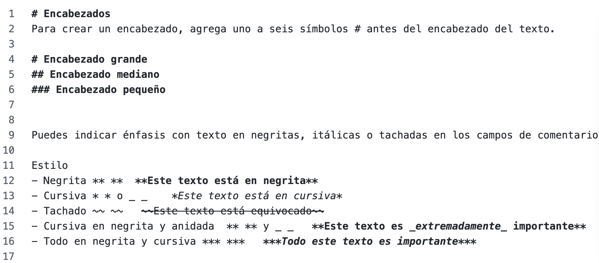
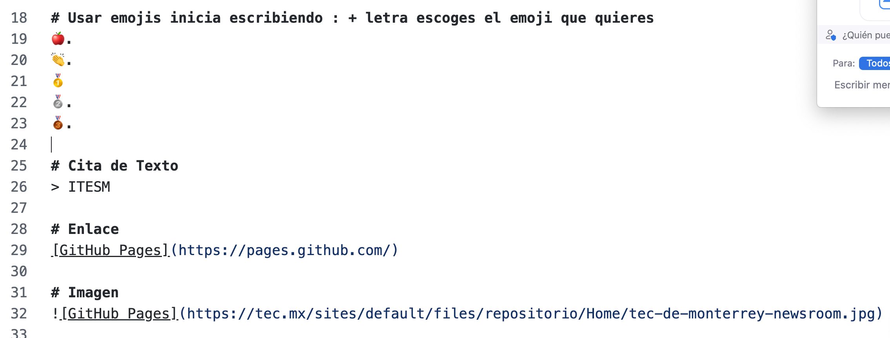
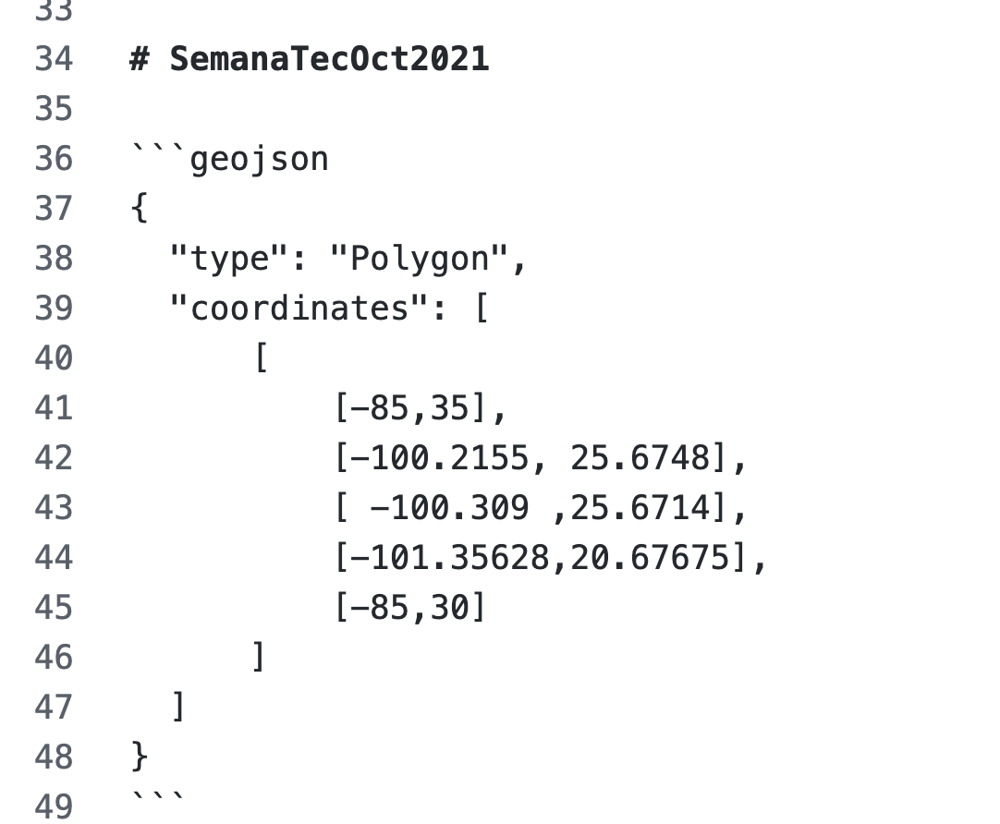
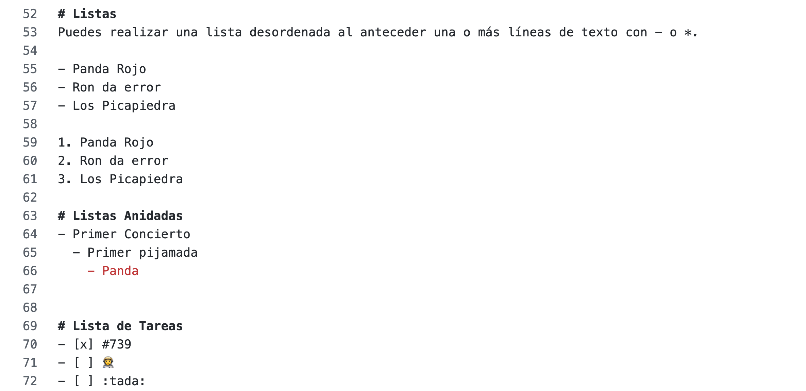

# SemanaTecMarzo










| Syntax | Description |
| ----------- | ----------- |
| Header | Title |
| Paragraph | Text |


```c++
{
  "firstName": "John",
  "lastName": "Smith",
  "age": 25
}
```

I need to highlight these == very important words ==.

Alejandro Hernández A01721287
ITC
Monterrey, N.L.
